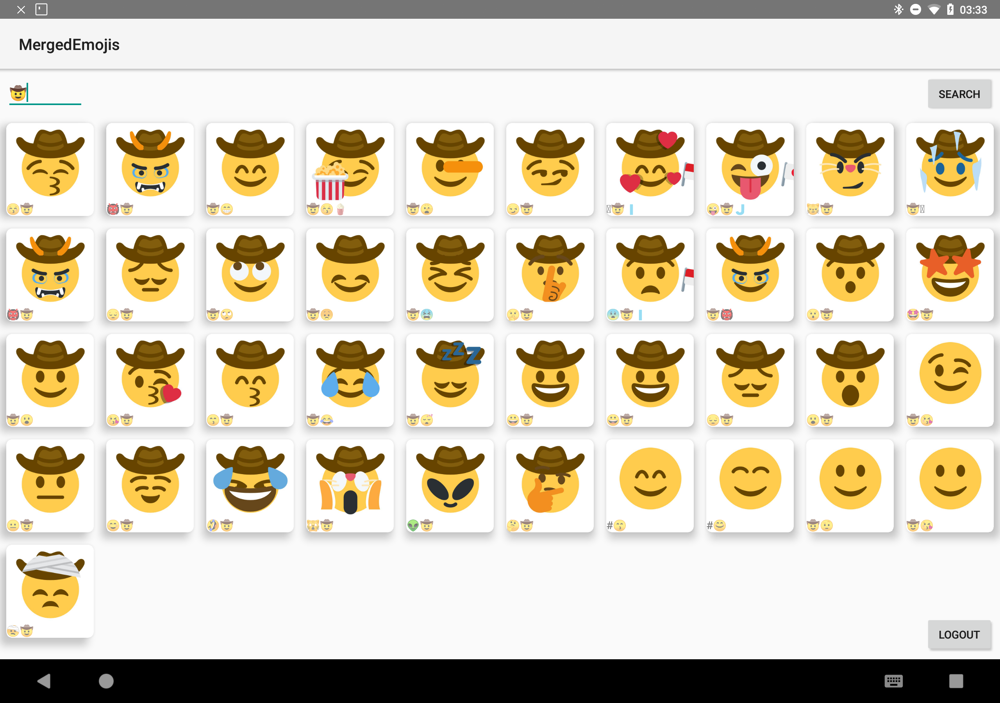
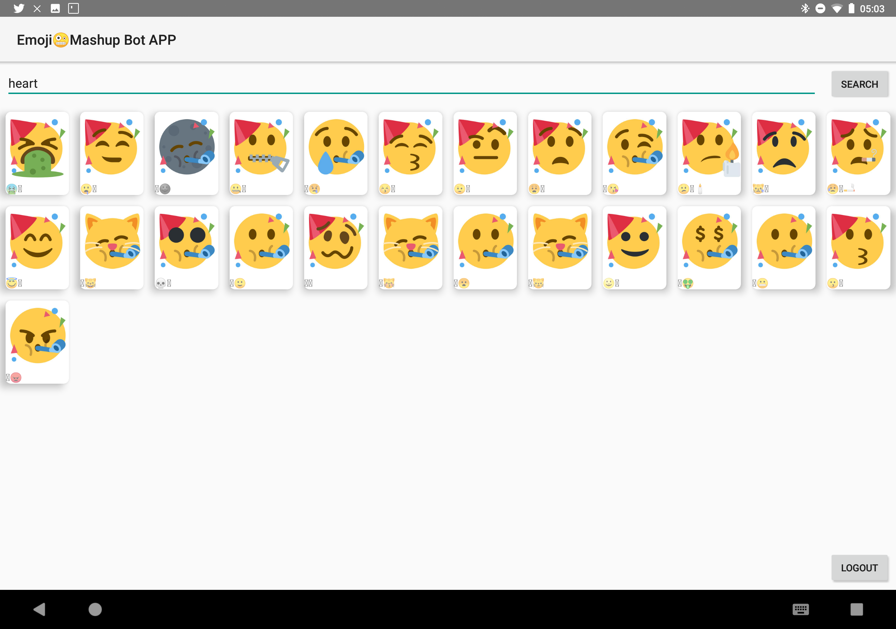

This is an android app for twitter.com/EmojiMashupBot
-----------------------------------------------------

It lets you search for emojis from the bot and returns you a list of them. You can browse too the original tweet and copy the image url to your favorite messageing app.

Enjoy.




Building
--------

Create `app/src/main/res/values/autho.xml` with your Twitter creds:

```
<resources>
  <string android:name="com.twitter.sdk.android.CONSUMER_KEY">XXXXXXXXXXX</string>
  <string android:name="com.twitter.sdk.android.CONSUMER_SECRET">XXXXXXXXXXX</string>
</resources>
```

> [docu](https://github.com/twitter-archive/twitter-kit-android/wiki/Getting-Started)
